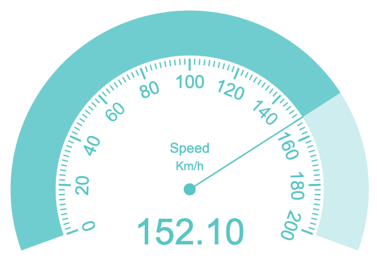

# radial-gauge



# usage

```javascript
import RadialGauge from './src/radial-gauge.js'

const canvas = document.querySelector('canvas.radial-gauge')

const speedometerOption = {
  id: 'speedometer',
  gaugeSize: 45,
  offset: 10,
  min: 0,
  max: 200,
  value: 0,
  ticks: 10,
  startAngle: 160,
  endAngle: 20,
  title: 'Speed',
  units: 'Km/h',
  text: 'rgba(0, 200, 200, 1)',
  empty: 'rgba(0, 200, 200, 0.3)',
  full: 'rgba(0, 200, 200, 0.8)',
}

const speedometer = new RadialGauge(canvas, speedometerOption)

const speed = 152.10
const duration = 0.5 // option

speedometer.setValueAnimated(speed, duration)
```
